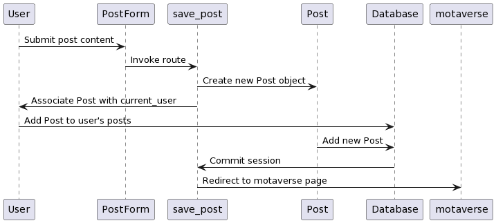
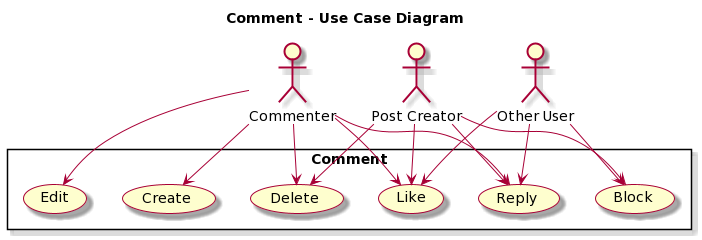
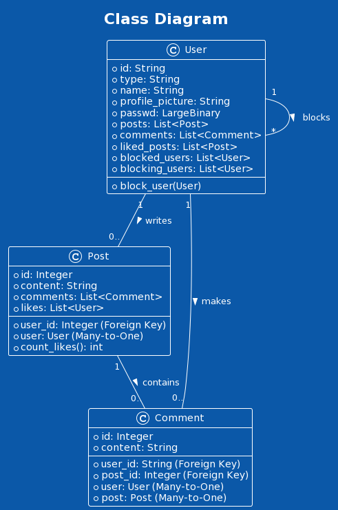

<p align="center">
    
</p>

# Overview

## Mission Statement
* For a better universe, motaverse 

"This web application seeks to inform its developers on the nuance and care taken into developing modern social media applications. By attempting to emulate basic functionality and recognizing the difficulty therein, a better appreciation for the tools we take for granted will be acquired."

# User stories

### User Story #1
*As a user, I want to be able to register for an online blogging platform. Given that a user provides a username, their name, profile picture, email and password, when the user clicks on the "Sign up" button then their user information is saved and a user profile is created.* 

**Additional Information**
* All members of the team, and Professor Mota should have their own user profile created.
* White box testing should be implemented to the SignUp function.


### User Story #2
*As a registered user, I want to log in to the online platform, so I can create new posts. Since a registered user has provided their ID and password, when the registered user clicks the “Sign In” button then, if their credentials are valid, they are presented with the main page, User can create a new post in the given "New post" field, and once they hit "post" their post will appear first alongside other posts all the posts that have been submitted in chronological order, showing the newest ones on top.*

```
User -> PostForm: Submit post content
PostForm -> save_post: Invoke route
save_post -> Post: Create new Post object
save_post -> User: Associate Post with current_user
User -> Database: Add Post to user's posts
Post -> Database: Add new Post
Database -> save_post: Commit session
save_post -> motaverse: Redirect to motaverse page
```
<p align="center">
    
</p>


### User Story #3
*As a registered user, I want to be able to comment on any already existing post. Since the post has already been created, I should be able to click "comment" button and write a reply to this post.*

**Additional information**
* Comments should appear in chronological order showing the older ones on top and newer ones at the bottom.
* The name  of the person that made that comment should appear next to the comment, along side the profile picture.

### User Story #4
*As a registered user, I want to be able to like any already existing post. I also want to be able to see how many likes any given post has.*

**Additional information**
* Users should be able to like a post only once
* If a user has liked a post, they should be able to remove that like.

### User Story #5
*As a registered user, I want to block people, if I have blocked a profile, all of that blocked profile's posts and commentsshould automatically disappear from my feed.*

**Additional information**
* To block someone you can find the block or unblock button next to their name in the "profile" list or on a post that they made.
* The block button should not be on the actively logged in profile.
* Blocked profiles should appear on my own profile page, where I can then remove them from that list.

### User Story #6
*As a registered user, if I have submitted a post, I want to be able to edit or delete the post in case I made a mistake.*

# Design


<!--
At a minimum, this section should have a class diagram that succinctly describes the main classes designed for this project, as well as their associations.-->

## Use case Diagram

```
@startuml
!theme amiga

left to right direction
actor User

usecase "Sign Up" as UC1
usecase "Log In" as UC2
usecase "Create Post" as UC3
usecase "Like Post" as UC4
usecase "Comment on Post" as UC5
usecase "Block User" as UC6


User --> UC1
User --> UC2
User --> UC3
User --> UC4
User --> UC5
User --> UC6

@enduml
```
<p align="center">
    
</p>

## Class Diagram 

<p align="center">
    
</p>

```
@startuml
!theme amiga
title Class Diagram

class User {
  + id: String
  + type: String
  + name: String
  + profile_picture: String
  + passwd: LargeBinary
  + posts: List<Post>
  + comments: List<Comment>
  + liked_posts: List<Post>
  + blocked_users: List<User>
  + blocking_users: List<User>
  + block_user(User)
}

class Post {
  + id: Integer
  + user_id: Integer (Foreign Key)
  + content: String
  + comments: List<Comment>
  + likes: List<User>
  + user: User (Many-to-One)
  + count_likes(): int
}

class Comment {
  + id: Integer
  + user_id: String (Foreign Key)
  + post_id: Integer (Foreign Key)
  + content: String
  + user: User (Many-to-One)
  + post: Post (Many-to-One)
}

User "1" -- "0.." Post : writes >
User "1" -- "0.." Comment : makes >
User "1" -- "*" User : blocks >
Post "1" -- "0.." Comment : contains >

@enduml
```

# Development Process 
<!--- **Please delete this comment once we don't need it, this is from README_TEMPLATE.md**
This section should be used to describe how the scrum methodology was used in this project. As a suggestion, include the following table to summarize how the sprints occurred during the development of this project.


Feel free to use your own format for this section, as long as you are able to communicate what has been described here.
-->

|Sprint#|Goals|Start|End|Done|Observations|
|---|---|---|---|---|---|
|1|Design, US#1|11/16/23|11/28/23|Finilized Design and finished sign up implementation|Team took firm decision on where to take the project, started implementing sign in and sign up functionality|
|2|US#2, US#3, US#4|11/28/23|12/02/23|Finished US#2, US#3, and US#4, started setting up for next sprint|Once User Story #2, implementation of posts, was implemented the other two user stories were not as comlicated|
|3|US#5, US#6|12/02/23|12/05/23|Finished implementing the last two user stories|We were able to get the last two user stories done in a short amount of time giving us extra time to finish the final touches, and make sure PEP8 was being used|
|Last|Testing and containerization|12/05/23|12/07/23|...|...|

Use the observations column to report problems encountered during a sprint and/or to reflect on how the team has continuously improved its work.


# Testing 
<!--
Share in this section the results of the tests performed to attest to the quality of the developed product, including the coverage of the tests in relation to the written code. There is no minimum code coverage expectation for your tests, other than expecting "some" coverage through at least one white-box and one black-box test.
-->
## Unit testing coverage

In test/ you will find ```test_creation.py```


## Black-box testing

## White-box testing

# Deployment 

The final product must demonstrate the integrity of at least 5 of the 6 planned user stories. The final product must be packaged in the form of a docker image. In this section, describe the steps needed to generate that image so that others can deploy the product themselves. All files required for the deployment must be available, including the docker file, source/binary code, external package requirements, data files, images, etc. Instructions on how to create a container from the docker image with parameters such as port mapping, environment variables settings, etc., must be described (if needed). 

<!--**We don't need this here, but just so we remember what we are getting graded on**-->
# Rubric

+5 Project's README file: mission statement


+10 Project's README file: user stories (~ 6 x 1.5)


+5 GitHub repository organization

+20 Project's README file and Jira Project: evidences of using scrum. 

+5 Code inspection: PEP8 compliance 

+10 Code inspection: comments, naming, functions, formatting, OOP best practices, error handling, etc.

+10 Code execution: white-box and black-box testing


+5 Project's README file: deployment instructions


Deductions: 

-10 user creation not available/working

-10 user authentication not available/working 

-5 for each user story not completed 

-5 **main** branch does not have consistent commits 

-5 **dev** branch does not have consistent commmits

-5 deployment does not work
