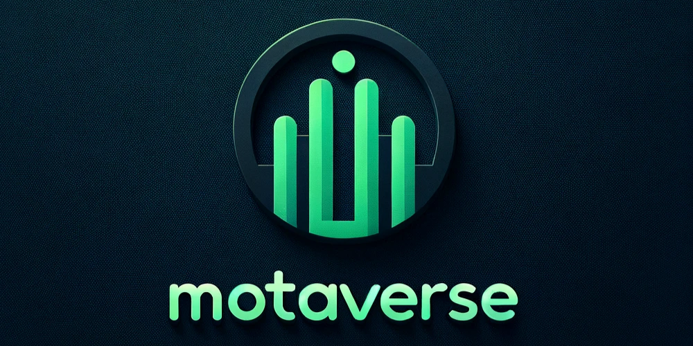
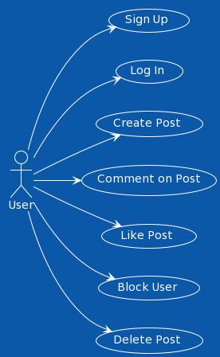

<p align="center">
    
</p>

# Overview

## Mission Statement
* For a better universe, motaverse 

"This web application seeks to inform its developers on the nuance and care taken into developing modern social media applications. By attempting to emulate basic functionality and recognizing the difficulty therein, a better appreciation for the tools we take for granted will be acquired."

### Use case Diagram

<p align="center">
    
</p>

# User stories

## User Story #1 - Sign up functionality
*As a user, I want to be able to register for an online blogging platform. Given that a user provides a username, their name, password and chooses profile picture, when the user clicks on the "Sign up" button then their user information is saved and a user profile is created.* 

**Additional Information**
* Profiles should be created to demonstrate functionality.


## User Story #2 - Post submission
*As a registered user, I want to log in to the online platform, so I can create new posts. Upon presenting valid credentials they are presented with the main page. User can create a new post in the given "New post" field, my post alongside other posts should appear in chronological order, showing the newest ones on top.*

**Additional Information**
* If credentials are not valid a notice should appear at the log in page
* Posts should appear immediately and in chronological order, showing the newest ones on top.
* Users should not be able to submit an empty post.


### Sequence Diagram for Post Submission

<p align="center">
    
</p>


## User Story #3 - Commenting on Posts
*As a registered user, I want to be able to comment on any already existing post. Since the post has already been created, I should be able to click "comment" button and write a reply to this post.*

**Additional information**
* Comments should appear in chronological order showing the older ones on top and newer ones at the bottom.
* The name  of the person that made that comment should appear next to the comment, along side the profile picture.

## User Story #4 - Like posts
*As a registered user, I want to be able to like any already existing post. I also want to be able to see how many likes any given post has.*

**Additional information**
* Users should be able to like a post only once
* If a user has liked a post, they should be able to remove that like.

## User Story #5
*As a registered user, I want to block people, if I have blocked a profile, I expect their posts and comments to be immediately hidden from my feed.*

**Additional information**
* The block button should not be on the actively logged in profile.
* To block someone you can find the block button next to their name in the "profile" list or on a post that they made.
* To unblock someone the unblock button should appear next to their name in the Profile list.


## User Story #6 - Deleting Posts
*As a registered user, if I have submitted a post or a comment, I want to be able to delete the post in case I made a mistake or no longer want it displayed.*

**Additional information**
* There should be a delete button next to posts or comments that I have created.
* Deleting a post should also remove all associated comments and likes.
* The option should only be visible to me as the creator of the post or comment.


# Design

## Class Diagram 

<p align="center">
    
</p>

# Development Process 

|Sprint#|Goals|Start|End|Done|Observations|
|---|---|---|---|---|---|
|1|Design, US#1|11/16/23|11/28/23|Finilized Design and finished sign up implementation|Team took firm decision on where to take the project, started implementing sign in and sign up functionality|
|2|US#2, US#3, US#4|11/28/23|12/02/23|Finished implementing post creation, comments to post as well as likes, started setting up for next sprint|Once User Story #2, implementation of posts, was implemented the other two user stories were not as comlpicated|
|3|US#5, US#6|12/02/23|12/05/23|Finished implementing user blocking feature as well as post and comment deletion|We were able to get the last two user stories done in a short amount of time giving us extra time to focus on the final touches, and make sure PEP8 was being used|
|Last|Testing and containerization|12/05/23|12/07/23|Finalized Implementation, testing and containerization|This final sprint was dedicated for testing and containerization, as well as final touches in documentation and code review|

You can find comprehensive details on our scrum meetings in the ```scrum``` folder. This folder contains detailed records of the development process, documenting each step and decision as the project evolved.

# Testing 

## Unit testing coverage

*Testing using python's coverage package.* In ```test``` folder you will find ```test_creation.py```. From there you can run 
``` 
coverage run -m unittest tests/test_creation.py
```
**Models Testing:**
* Focuses on internal logic of data models (User, Post, Comment).
* Validates object creation and database persistence.
* Ensures correct relationships and associations between models.

**Routes Testing:**
* Evaluates the application's endpoints without delving into internal workings.
* Includes a test for the /save_post route, simulating a POST request and verifying the correct addition of posts to the database.
* Utilizes mocked user sessions to bypass authentication for route testing.
<!--
Share in this section the results of the tests performed to attest to the quality of the developed product, including the coverage of the tests in relation to the written code. There is no minimum code coverage expectation for your tests, other than expecting "some" coverage through at least one white-box and one black-box test.
-->
## Black-box testing

## White-box testing

# Deployment 

The final product must demonstrate the integrity of at least 5 of the 6 planned user stories. The final product must be packaged in the form of a docker image. In this section, describe the steps needed to generate that image so that others can deploy the product themselves. All files required for the deployment must be available, including the docker file, source/binary code, external package requirements, data files, images, etc. Instructions on how to create a container from the docker image with parameters such as port mapping, environment variables settings, etc., must be described (if needed). 

## Deployment Instructions

Instructions for deploying this project are simple. All files necessary for image generation are present in the repository by default. Only some simple port mapping is required.

```
sudo docker build -t motaverse .
sudo docker run -p 5000:5000 motaverse
```

Then, when various urls are listed in the terminal, select `http://127.0.0.1:5000/`. 

<!-- Here in case we need to change anything delete before submission    *******
```
****Use Case Diagram:
@startuml
!theme amiga

left to right direction
actor User

usecase "Sign Up" as UC1
usecase "Log In" as UC2
usecase "Create Post" as UC3
usecase "Comment on Post" as UC4
usecase "Like Post" as UC5
usecase "Block User" as UC6
usecase "Delete Post" as UC7

User - -> UC1
User - -> UC2
User - -> UC3
User - -> UC4
User - -> UC5
User - -> UC6
User - -> UC7

@enduml
****Class Diagram
@startuml
!theme amiga
title Class Diagram

class User {
  + id: String
  + type: String
  + name: String
  + profile_picture: String
  + passwd: LargeBinary
  + posts: List<Post>
  + comments: List<Comment>
  + liked_posts: List<Post>
  + blocked_users: List<User>
  + blocking_users: List<User>
  + block_user(User)
}

class Post {
  + id: Integer
  + user_id: Integer (Foreign Key)
  + content: String
  + comments: List<Comment>
  + likes: List<User>
  + user: User (Many-to-One)
  + count_likes(): int
}

class Comment {
  + id: Integer
  + user_id: String (Foreign Key)
  + post_id: Integer (Foreign Key)
  + content: String
  + user: User (Many-to-One)
  + post: Post (Many-to-One)
}

User "1" -- "0.." Post : writes >
User "1" -- "0.." Comment : makes >
User "1" -- "*" User : blocks >
Post "1" -- "0.." Comment : contains >

@enduml
*****Sequence Diagram
User -> PostForm: Submit post content
PostForm -> save_post: Invoke route
save_post -> Post: Create new Post object
save_post -> User: Associate Post with current_user
User -> Database: Add Post to user's posts
Post -> Database: Add new Post
Database -> save_post: Commit session
save_post -> motaverse: Redirect to motaverse page
```
-->
