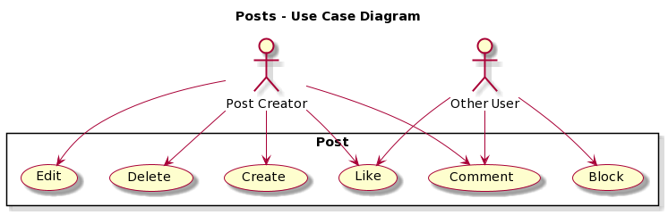

    

# Overview
<!-- **Please delete this comment once we don't need it, this is from README_TEMPLATE.md**
Use this section to outline the vision for the product to be developed, including a use case diagram that shows the main user interactions with the product, in order to provide readers with an overview of the project.
-->

## Mission Statement
* For a better universe, motaverse 
* Where dreams come true
## Use case Diagram

    

    

# Design

<!-- **Please delete this comment once we don't need it, this is from README_TEMPLATE.md**
Describe the user stories designed for the project, including clear acceptance criteria and point estimate for each of them. User stories must be consistent with the use case diagram. Refer to the user stories using US#1, US#2, etc. At least one of the user stories, not related to user creation or authentication, must be detailed by a sequence diagram. 
-->
### User Story #1
*As a user, I want to be able to register for an online blogging platform. Given that a user provides a username, their name, profile picture, email and password, when the user clicks on the "Sign up" button then their user information is saved and a user profile is created.* 

**Additional Information**
* All members of the team, and Professor Mota should have their own user profile created.
* White box testing should be implemented to the SignUp function.

### User Story #2
*As a registered user, I want to log in to the online platform, so I can create new posts. Since a registered user has provided their ID and password, when the registered user clicks the “Sign In” button then, if their credentials are valid, they are presented with all the posts that have been submitted in chronological order, showing the newest ones on top.*

### User Story #3
*As a registered user, I want to be able to comment on any already existing post. Since the post has already been created, I should be able to click "comment" button and write a reply to this post.*

**Additional information**
* Comments should appear in chronological order showing the older ones on top and newer ones at the bottom.
* The name or user ID of the person that made that comment should appear next to the comment.

### User Story #4
*As a registered user, I want to be able to like any already existing post. I also want to be able to see how many likes any given post has.*

**Additional information**
* Users should be able to like a post only once
* If a user has liked a post, they should be able to remove that like.

### User Story #5
*As a registered user, if I see a profile name, I want to be able to click on that name and go to their profile, where I will be able to see that person's profile picture and name on the left, and the middle there will be all of that specific person's posts.*

**Additional information**
* Any given person would also be able to see their own profile page

### User Story #6
*As a registered user, I want to block people, if I have blocked a profile, all of that blocked profile's posts should automatically disappear from my feed, and they should not be able to see any of my posts.*

**Additional information**
* To block someone you need to go into their profile, and there you can find a "block" button
* The block button should not be on the profile page that is currently logged in
* Blocked profiles should appear on my own profile page, where I can then remove them from that list.

## Model 

At a minimum, this section should have a class diagram that succinctly describes the main classes designed for this project, as well as their associations.

# Development Process 
<!--- **Please delete this comment once we don't need it, this is from README_TEMPLATE.md**
This section should be used to describe how the scrum methodology was used in this project. As a suggestion, include the following table to summarize how the sprints occurred during the development of this project.

Feel free to use your own format for this section, as long as you are able to communicate what has been described here.
-->

|Sprint#|Goals|Start|End|Done|Observations|
|---|---|---|---|---|---|
|1|US#1, US#2|11/16/23|11/21/23|...|...|
|2|US#3, US#4|11/12/23|11/28/23|...|...|
|1|US#5, US#6|11/29/23|12/05/23|...|...|
|Last|Finishing Project|12/06/23|12/07/23|...|...|

Use the observations column to report problems encountered during a sprint and/or to reflect on how the team has continuously improved its work.

# Testing 

Share in this section the results of the tests performed to attest to the quality of the developed product, including the coverage of the tests in relation to the written code. There is no minimum code coverage expectation for your tests, other than expecting "some" coverage through at least one white-box and one black-box test.

# Deployment 

The final product must demonstrate the integrity of at least 5 of the 6 planned user stories. The final product must be packaged in the form of a docker image. In this section, describe the steps needed to generate that image so that others can deploy the product themselves. All files required for the deployment must be available, including the docker file, source/binary code, external package requirements, data files, images, etc. Instructions on how to create a container from the docker image with parameters such as port mapping, environment variables settings, etc., must be described (if needed). 

<!--**We don't need this here, but just so we remember what we are getting graded on**-->
# Rubric

+5 Project's README file: mission statement

+5 Project's README file: use case diagram 

+10 Project's README file: user stories (~ 6 x 1.5)

+5 Project's README file: sequence diagram 

+5 Project's README file: class diagram 

+5 GitHub repository organization

+20 Project's README file and Jira Project: evidences of using scrum. 

+5 Code inspection: PEP8 compliance 

+10 Code inspection: comments, naming, functions, formatting, OOP best practices, error handling, etc.

+10 Code execution: white-box and black-box testing

+5 Project's README file: test coverage report using Python's **coverage**

+5 Project's README file: deployment instructions

+15 team/self evaluation

Deductions: 

-10 user creation not available/working

-10 user authentication not available/working 

-5 for each user story not completed 

-5 **main** branch does not have consistent commits 

-5 **dev** branch does not have consistent commmits

-5 deployment does not work
